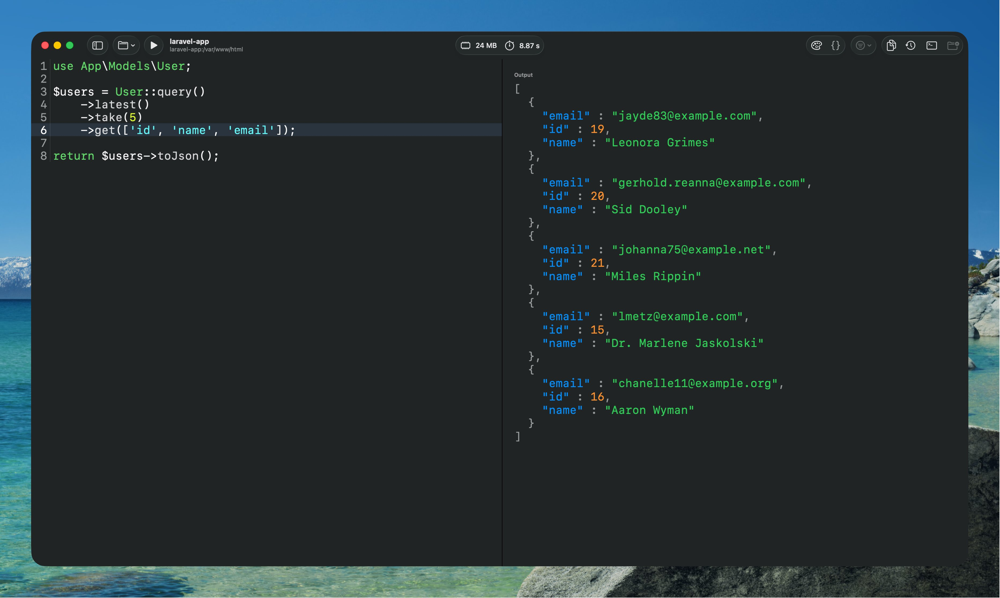

# TinkerSwift

TinkerSwift is a native macOS app written in Swift/SwiftUI, focused on PHP and Laravel workflows as a lightweight playground .



## Current Focus

- PHP projects, especially Laravel apps
- Fast local execution loop for snippets and REPL-like workflows
- Editor + sidebar + execution panes tuned for project-based work

## Requirements

- macOS 14.0+
- Xcode 16+
- [XcodeGen](https://github.com/yonaskolb/XcodeGen)

## Quick Start

```bash
brew install xcodegen
xcodegen generate
open TinkerSwift.xcodeproj
```

Build from terminal:

```bash
xcodebuild -project TinkerSwift.xcodeproj \
  -scheme TinkerSwift \
  -configuration Debug \
  -derivedDataPath .build-xcode \
  build
```

Run built app:

```bash
open .build-xcode/Build/Products/Debug/TinkerSwift.app
```

## Project Structure

```text
TinkerSwift/
  App/                  # App entry, container, window factory, app delegate
  Core/
    Contracts/          # Cross-feature protocols/contracts
    Utilities/          # Shared helpers
  Features/
    Workspace/          # Workspace shell + state + layout
    Editor/             # Editor views and integration points
    Execution/          # PHP execution flow and result presentation
    Projects/           # Project sidebar/navigation
    Settings/           # User settings UI
  Services/
    Environment/        # Process + binary/environment utilities
    LSP/                # PHP LSP/completion services
    Persistence/        # Local persistence implementations
```

## Development Notes

- Keep feature UI/state in `Features/*`.
- Keep external integrations in `Services/*`.
- Keep shared abstractions in `Core/Contracts`.
- LSP is optional at runtime and should fail gracefully.

## Contributing

1. Keep changes scoped to the correct module/folder.
2. Regenerate project if sources change:
   - `xcodegen generate`
3. Run a debug build before opening a PR:
   - `xcodebuild -project TinkerSwift.xcodeproj -scheme TinkerSwift -configuration Debug -derivedDataPath .build-xcode build`

